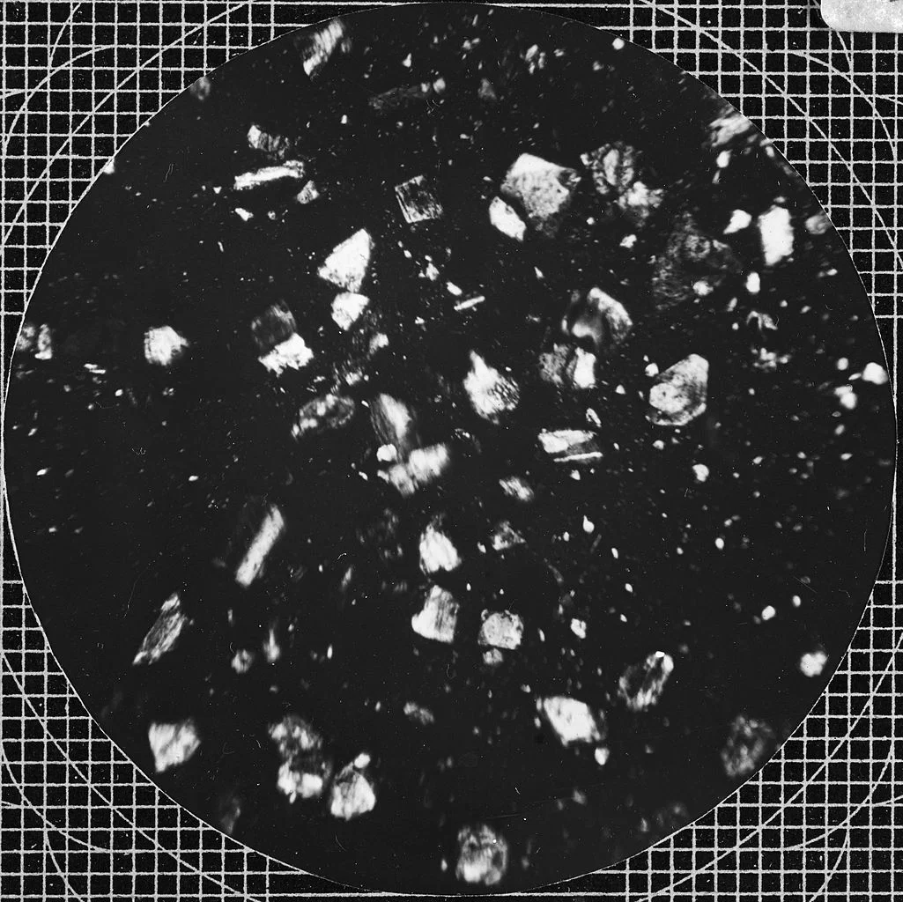

import Img from '../components/Img.astro';

# remark-image-import demo

Every `` below uses a **string** `src` with no `import` statement. The
[`@xsynaptic/remark-image-import`](https://www.npmjs.com/package/@xsynaptic/remark-image-import)
plugin rewrites each one into an ESM image import at build time, so `astro:assets` optimizes them.

	A 1606 map of the north pole by Mercator and Hondius.
</Img>

	A microscopic photograph of volcanic dust from Mount Soufrière, St Vincent (catalogue
	YORYM:TA0019, 1902), by Tempest Anderson, a pioneer of volcano photography.
</Img>

	The same path as the first image, deduped to a single import.
</Img>

No `import ... from './*.webp'` appears anywhere in this file. Inspect the built HTML: the ``
tags point at optimized `/_astro/*` URLs, and only two imports are generated for three usages.
